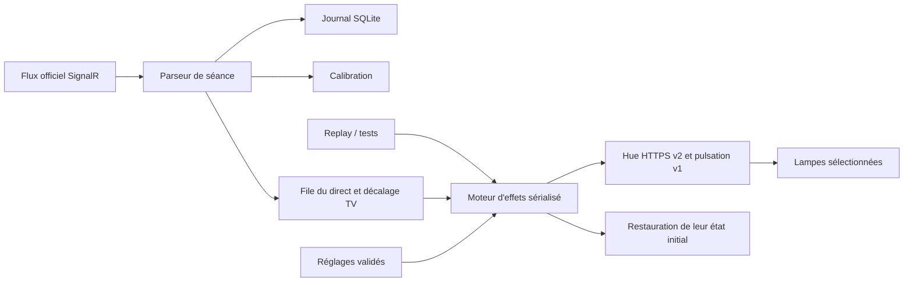

# Architecture v2

```text
src/F1Hue.Core/             Modèles, validation, parsing F1, calibration, ordonnanceur, effets
src/F1Hue.Infrastructure/   SignalR officiel, Hue HTTPS v2/v1, découverte, SQLite, coffre, migration
apps/host/                 Processus ASP.NET Core, API, authentification et interface embarquée
apps/web/                  Interface TypeScript + CSS, sans framework ni dépendance au runtime
apps/web/dist/             Sortie générée par esbuild (non suivie dans Git)
deploy/macos/              Lanceur Swift dans la barre des menus
deploy/windows/           Lanceur C# dans la zone de notification et installateur Inno Setup
deploy/linux/             Installation du service utilisateur systemd
deploy/docker/            Conteneur sans privilèges
tests/F1Hue.Tests/         Vérifications du domaine et des adaptateurs
tests/api-smoke.mjs        Intégration HTTP avec pont simulé
```

## Flux d’un événement



Le parseur reste indépendant du réseau. Il distingue les snapshots des nouveaux événements, déduplique les drapeaux et accepte un rouge après `Aborted` ou un damier après `Finished`. Les topics restent souscrits même si un événement est désactivé dans l’interface.

Un seul mode détient les lampes. Le direct abonne une file bornée aux événements du flux partagé. Chaque événement retient son heure monotone de réception et le décalage configuré à cet instant. Ses règles de couleur, activation et durée sont lues au moment où il est joué. Les changements de décalage ne réordonnent pas les événements déjà en attente.

À l’activation, la file démarre vide : le dernier drapeau mémorisé n’est pas rejoué. Les snapshots de connexion et de reconnexion restent des informations d’état pour l’interface ; seuls les nouveaux événements déclenchent des effets. Activer le direct pendant un drapeau déjà en cours attend donc le prochain changement.

Une génération et un verrou sérialisent les opérations Hue. Le minuteur d’un ancien effet ne peut restaurer les lampes après le démarrage d’un effet plus récent. La fin d’un effet fixe et un événement désactivé restaurent l’état de début de mode. Stop respecte l’option de restauration de sortie. Une restauration interrompue reste enregistrée pour être retentée au lancement suivant.

La luminosité/couleur utilise xy. Depuis preview.8, les couleurs fixes de plusieurs lampes utilisent une seule commande HTTPS v1 sur un groupe contenant exactement la sélection. Une lampe unique utilise v2. Depuis preview.5, les clignotements utilisent l’animation native de l’ancien moteur Python : API Hue v1 `alert=lselect` pour SC, VSC et damier ; `alert=select` toutes les 0,7 s pour le bleu. Depuis preview.9, une seule commande applique la couleur, annule un éventuel colorloop et lance la pulsation avec `transitiontime=0`. La transition configurable reste utilisée pour les couleurs fixes ; la courbe des clignotements est produite par le pont. Les requêtes v1 et v2 réutilisent une connexion HTTPS dont le certificat est vérifié ; les proxies et redirections restent interdits. La clé du pont reste côté service ; les erreurs sont expurgées et les URL authentifiées ne sont pas journalisées.

Pour plusieurs lampes, un groupe contenant exactement leurs identifiants v1 est réutilisé ou créé, sans modifier un groupe existant. Le groupe 0 est interdit. Avant chaque commande de groupe, y compris le changement de couleur et le renouvellement (10 s pour lselect), sa composition est revérifiée. Les lampes calculent la courbe et son rythme ; le réglage de transition ne pilote que le changement de couleur. Le moteur Entertainment expérimental et sa dépendance DTLS ont été retirés. Seule la récupération d’une ancienne zone encore active est conservée.

Les lampes et le groupe à arrêter sont persistés avant la commande native. L’arrêt annule et attend le renouvellement en cours, puis envoie un unique `alert=none` au groupe si sa sélection est toujours exacte, y compris après redémarrage. Si le groupe a changé ou disparu, seules les lampes mémorisées sont annulées ; les petites sélections sont envoyées ensemble et les grandes sélections par lots de dix au maximum par seconde. Les cibles en échec restent persistées avec l’état initial pour une nouvelle tentative. Une ancienne zone Entertainment restée active est toujours libérée avant de reprendre la sélection. La sélection reste verrouillée tant que l’arrêt est incomplet.

Depuis preview.9, plusieurs lampes retrouvent leurs états individuels par un seul rappel de scène v2. Avant de lancer le mode, une zone temporaire contient uniquement les services de lampes choisis (les zones v2 contiennent des lampes, les pièces contiennent des appareils), et une scène mémorise chaque luminosité, couleur ou température, état allumé/éteint, dégradé et effet natif. Sa composition et ses actions sont vérifiées avant le rappel ; une zone élargie ou une scène modifiée n’est pas rappelée. Le mode supprime ses ressources temporaires après l’arrêt ; une ressource adoptée ou éditée ailleurs est conservée. Un jeton de création persisté permet de récupérer une création dont la réponse a été perdue. Une restauration déjà terminée n’est pas rejouée par le nettoyage suivant. Cette stratégie suit les actions synchrones des [scènes v2 décrites dans les schémas OpenHue](https://github.com/openhue/openhue-api/blob/main/src/scene/schemas/ScenePost.yaml). Les tests automatisés ne garantissent pas un écart physique de zéro milliseconde sur le réseau Zigbee.

Depuis preview.10, le succès HTTP du rappel ne suffit plus à terminer Stop. La scène et sa zone sont conservées pendant le fondu, puis deux lectures des états des lampes, espacées de 250 ms, vérifient le résultat. Un état incomplet déclenche un nouveau rappel du même groupe, avec trois essais au maximum. Les tolérances couvrent la quantification de luminosité, mirek et xy. Pour une lampe éteinte, l’extinction est vérifiée ; le pont ne confirme pas toujours les paramètres de couleur d’une lampe éteinte. Un échec conserve la scène et la sauvegarde pour Réessayer Stop. Un nouveau drapeau ou Stop annule la vérification du minuteur précédent avant de prendre le verrou du moteur, pour éviter que ces contrôles retardent un effet plus récent.

Depuis preview.11, le lancement d’un mode valide les lampes et récupère un arrêt réellement incomplet, mais ne capture plus l’ambiance d’avance. La sauvegarde est prise juste avant le premier effet joué ; arrêter un direct sans avoir joué de drapeau ne modifie aucune couleur. Après une restauration terminée, l’effet suivant capture à nouveau l’ambiance courante, y compris une scène choisie entre-temps dans Hue. La sélection reste fixe pendant le mode.

Le diagnostic authentifié `GET /api/hue/diagnostics` lit les états des lampes sélectionnées et les scènes qui les concernent, sans clé Hue. `POST /api/hue/scene` permet de rappeler une scène existante uniquement à l’arrêt : son identifiant doit être un UUID, ses actions et la composition actuelle de son groupe doivent cibler exactement la sélection. Le rappel d’une scène plus large est refusé avant toute écriture.

## Stockage et sécurité

SQLite stocke les réglages validés, événements dérivés et sessions d’authentification hachées du mode serveur. Les sessions de bureau sont hachées et conservées en mémoire. Aucun besoin d’un serveur de base de données. Le journal est limité à 100 000 événements.

Le coffre Hue est chiffré avec AES-GCM. Sa clé est dans le trousseau macOS, protégée par DPAPI sur Windows, ou dans un fichier privé sur Linux. La protection Linux suppose que le compte système et ses sauvegardes sont protégés : elle ne résiste pas à un attaquant qui lit à la fois le coffre et sa clé.

Le certificat TLS Hue est mémorisé au premier contact local sans envoi de clé, puis vérifié par empreinte pour les requêtes authentifiées. C’est une confiance au premier usage, pas une vérification de la CA Signify. Une empreinte modifiée bloque les requêtes jusqu’à une nouvelle liaison physique.

L’API exige une session. Le mode serveur utilise un mot de passe dérivé avec PBKDF2-SHA256, sel aléatoire et 600 000 itérations, avec limitation des tentatives. Cookies HttpOnly/SameSite Strict, protection Host/Origin, en-tête spécifique pour les mutations, CSP sans scripts inline et corps limité à 64 Ko. Les secrets ne sont jamais inclus dans `/api/state` ou `/api/settings`.

Depuis preview.7, les lanceurs Mac et Windows activent explicitement `--desktop --listen 127.0.0.1`. Le service écrit un secret aléatoire de 256 bits dans un fichier privé du profil, renouvelé à chaque démarrage et supprimé à l’arrêt. Le lanceur prouve sa possession via un en-tête HTTP local, sans proxy ni redirection, pour obtenir un ticket aléatoire à usage unique expirant après une minute. Ce ticket est transmis dans le fragment de l’URL, retiré de l’historique par l’interface et échangé par POST contre un cookie de session de huit heures. Le secret du lanceur n’entre jamais dans le navigateur. Les tickets sont hachés en mémoire, consommés sous verrou et limités à vingt ouvertures en attente. Les cookies deviennent invalides au redémarrage et la déconnexion les révoque.

Le mode bureau refuse toute adresse d’écoute différente de `127.0.0.1`, tout Host ou port différent de l’adresse canonique, et les connexions non locales. Les routes de configuration et connexion par mot de passe y sont absentes. Le mode serveur n’expose pas les routes de connexion automatique et n’accepte pas les sessions de bureau. Un ancien mot de passe et ses sessions stockées sont préservés ; cette séparation ne modifie pas le coffre Hue ni ses autorisations macOS.

## Distribution et mises à jour

Le moteur est identique dans tous les paquets. Le lanceur de bureau possède le processus enfant et ouvre le navigateur. Une fermeture normale donne au service le temps de stopper les effets et de restaurer les lampes.

Les paquets actuels se mettent à jour en remplaçant l’application arrêtée, sans modifier son dossier de données. Le menu ouvre la page de releases officielle du dépôt. Il n’exécute pas automatiquement un binaire téléchargé. Une mise à jour automatique signée et la publication des installateurs demandent encore une infrastructure de signature et de release.

Les scripts Mac acceptent `APPLE_SIGNING_IDENTITY` et `APPLE_NOTARY_PROFILE`. Le script Windows accepte `WINDOWS_SIGNING_THUMBPRINT`. Aucun secret de signature n’est stocké dans Git.

## Garanties de concurrence depuis preview.6

Le profil est verrouillé par le système avant l’ouverture de SQLite, l’import et toute récupération Hue. Ce verrou est libéré à la fermeture ou après un crash. Le fichier de verrou n’est jamais supprimé pendant son utilisation.

Le serveur réserve la récupération initiale dans le même coordinateur que les commandes, puis attend que le port soit effectivement ouvert avant de toucher aux lampes. Les corps HTTP sont analysés sans verrou de commande. Stop invalide les commandes reçues précédemment, annule l’opération active et les téléchargements, puis attend leur fin avant de nettoyer les lampes. Une requête lente de connexion ne retient donc pas Stop.

Les archives sont téléchargées hors verrou, avec une échéance qui couvre aussi leur corps. Leur démarrage reprend le verrou et revérifie l’absence de mode actif. Les réglages restent sérialisés ; la sélection reste fixe pendant un mode.

Le parseur conserve séparément la neutralisation globale et les secteurs jaunes. Un message local ne remplace pas SC/VSC/RED. Un vert global explicite ou TrackStatus peut libérer la neutralisation. Les champs Utc sans suffixe sont explicitement interprétés en UTC. La déduplication du direct inclut l’identifiant de séance. Le replay utilise également TrackStatus.

L’interface sépare les types, les appels API, les composants communs et les vues. La version affichée est lue depuis la version compilée du moteur.
